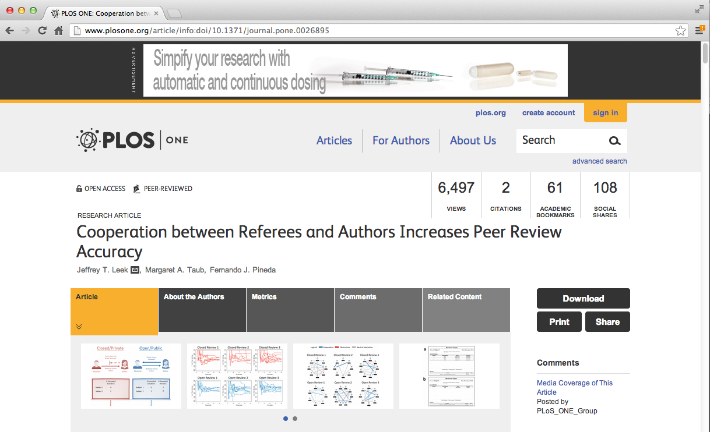

```{r setup, include=FALSE}
knitr::opts_chunk$set(echo = T, message = F, error = F, warning = F, comment = NA, fig.align = 'center', dpi = 100, tidy = F)
```


## 關於本課程

* 這段課程的主題是「如何準備好分析要用的資料」，包含以下概念：
  * 尋找與擷取「原始資料」(raw data)
  * 「整齊資料」(Tidy data) 的原則，以及如何讓資料整齊
  * 相關的 R 套件
  * 實際案例練習


## 你期待資料的樣子


## 資料實際上的長相


[http://brianknaus.com/software/srtoolbox/s_4_1_sequence80.txt](http://brianknaus.com/software/srtoolbox/s_4_1_sequence80.txt)


## 資料實際上的長相 


[https://dev.twitter.com/docs/api/1/get/blocks/blocking](https://dev.twitter.com/docs/api/1/get/blocks/blocking)


## 資料實際上的長相


[http://blue-button.github.com/challenge/](http://blue-button.github.com/challenge/)


## 資料在哪裡？


[http://rickosborne.org/blog/2010/02/infographic-migrating-from-sql-to-mapreduce-with-mongodb/](http://rickosborne.org/blog/2010/02/infographic-migrating-from-sql-to-mapreduce-with-mongodb/)


## 資料在哪裡？


[https://dev.twitter.com/docs/api/1/get/blocks/blocking](https://dev.twitter.com/docs/api/1/get/blocks/blocking)


## 資料在哪裡？


[http://data.gov.tw//](http://data.gov.tw//)


## 課程目標

</br></br>

<center><rt>**原始資料** -> **資料處理** -> **整齊資料**</rt> -> 資料分析 -> 資料溝通 </center>


-----

# 原始資料與整齊資料


## 資料的定義

<q>資料是以數值的方式呈現，用來描述特定對象的性質或數量</q>

_Data are values of qualitative or quantitative variables, belonging to a set of items._

[http://en.wikipedia.org/wiki/Data](http://en.wikipedia.org/wiki/Data)


## 資料的定義
<q>Data are values of qualitative or quantitative variables, belonging to a <redtext>set of items</redtext>.</q>

[http://en.wikipedia.org/wiki/Data](http://en.wikipedia.org/wiki/Data)

__Set of items__: Sometimes called the population; the set of objects you are interested in


## 資料的定義
<q>Data are values of qualitative or quantitative <redtext>variables</redtext>, belonging to a set of items.</q>

[http://en.wikipedia.org/wiki/Data](http://en.wikipedia.org/wiki/Data)

__Variables__: A measurement or characteristic of an item.


## 資料的定義
<q>Data are values of <redtext>qualitative</redtext> or <redtext>quantitative</redtext> variables, belonging to a set of items.</q>

[http://en.wikipedia.org/wiki/Data](http://en.wikipedia.org/wiki/Data)


__Qualitative__: Country of origin, sex, treatment

__Quantitative__: Height, weight, blood pressure


## 原始資料與整齊資料

__原始資料__

* 資料的原始型態
* 通常很難直接拿來分析
* 資料分析包括「清理與處理」
* 原始資料可能只需要處理一次

[http://en.wikipedia.org/wiki/Raw_data](http://en.wikipedia.org/wiki/Raw_data)


## 原始資料與整齊資料

__整齊資料__

* 可以直接用於分析的資料
* 處理的步驟可能包括合併、分割、轉換等等
* 資料的處理可能需要符合固定的標準
* 資料處理的每一道程序最好都記錄下來

[http://en.wikipedia.org/wiki/Computer_data_processing](http://en.wikipedia.org/wiki/Computer_data_processing)


## 常用的資料整理技巧

* 資料分割與排序（Subseting and sorting）
* 資料摘要（Summarizing）
* 增加新變項（Creating new variables）
* 資料重整（Reshaping data）
* 資料合併（Merging data）


## 使用到的套件
* reshape2
* plyr / dplr
* Hmisc


## 資料分割與排序（Subseting and sorting）

```{r subsetting}
set.seed(13435)
X <- data.frame("var1"=sample(1:5),"var2"=sample(6:10),"var3"=sample(11:15))
X <- X[sample(1:5),]; X$var2[c(1,3)] = NA
X
```


## 資料分割

```{r ,dependson="subsetting", echo = TRUE, warning=FALSE}
X[,1]
X[,"var1"]
X[1:2,"var2"]
```


## Logicals ands and ors

```{r ,dependson="subsetting", echo = TRUE, warning=FALSE}
X[(X$var1 <= 3 & X$var3 > 11),]
X[(X$var1 <= 3 | X$var3 > 15),]
```


## 遺失值的處理（missing values）

```{r ,dependson="subsetting", echo = TRUE, warning=FALSE}
X[which(X$var2 > 8),]
```


## 排序

```{r ,dependson="subsetting", echo = TRUE, warning=FALSE}
sort(X$var1)
sort(X$var1,decreasing=TRUE)
sort(X$var2,na.last=TRUE)
```


## 排序

```{r ,dependson="subsetting", echo = TRUE, warning=FALSE}
X[order(X$var1),]
```


## 排序

```{r ,dependson="subsetting", echo = TRUE, warning=FALSE}
X[order(X$var1,X$var3),]
```


## 用 plyr 排序

```{r ,dependson="subsetting", echo = TRUE, warning=FALSE}
require(plyr)
arrange(X,var1)
arrange(X,desc(var1))
```


## 新增資料欄位

```{r,dependson="subsetting", echo = TRUE, warning=FALSE}
X$var4 <- rnorm(5)
X
```


## 新增資料欄位

```{r,dependson="subsetting", echo = TRUE, warning=FALSE}
Y <- cbind(X,rnorm(5))
Y
```


## 資料摘要（Summarizing）：範例資料


[https://data.baltimorecity.gov/Community/Restaurants/k5ry-ef3g](https://data.baltimorecity.gov/Community/Restaurants/k5ry-ef3g)


## 資料摘要（Summarizing）：取得資料

```{r getData, cache=T}
if(!file.exists("./data")){dir.create("./data")}
fileUrl <- "https://data.baltimorecity.gov/api/views/k5ry-ef3g/rows.csv?accessType=DOWNLOAD"
download.file(fileUrl,destfile="./data/restaurants.csv",method="curl")
restData <- read.csv("./data/restaurants.csv")
```


## 看看資料的頭跟尾

```{r ,dependson="getData"}
head(restData,n=3)
tail(restData,n=3)
```


## 做摘要

```{r ,dependson="getData"}
summary(restData)
```


## 詳細一點的摘要

```{r ,dependson="getData"}
str(restData)
```


## 四分位數

```{r ,dependson="getData"}
quantile(restData$councilDistrict,na.rm=TRUE)
quantile(restData$councilDistrict,probs=c(0.5,0.75,0.9))
```


## 用 table 做摘要

```{r ,dependson="getData"}
table(restData$zipCode,useNA="ifany")
```


## 用 table 做摘要

```{r ,dependson="getData"}
table(restData$councilDistrict,restData$zipCode)
```


## 檢查遺失值

```{r ,dependson="getData"}
sum(is.na(restData$councilDistrict))
any(is.na(restData$councilDistrict))
all(restData$zipCode > 0)
```


## 加總行與列

```{r,dependson="getData"}
colSums(is.na(restData))
all(colSums(is.na(restData))==0)
```


## 尋找特定資料

```{r,dependson="getData"}
table(restData$zipCode %in% c("21212"))
table(restData$zipCode %in% c("21212","21213"))

```


## 尋找特定資料


```{r,dependson="getData"}
restData[restData$zipCode %in% c("21212","21213"),]
```


## 交叉分析表：大學入學申請資料

```{r adm}
data(UCBAdmissions)
DF = as.data.frame(UCBAdmissions)
summary(DF)
```


## 交叉分析表：性別/核准入學的頻率

```{r ,dependson="adm"}
xt <- xtabs(Freq ~ Gender + Admit,data=DF)
xt
```


## Flat tables：羊毛紡織資料

```{r wb}
warpbreaks$replicate <- rep(1:9, len = 54)
xt = xtabs(breaks ~.,data=warpbreaks)
xt

```


## Flat tables

```{r ,dependson="wb"}
ftable(xt)
```


## 了解資料的大小

```{r}
fakeData = rnorm(1e5)
object.size(fakeData)
print(object.size(fakeData),units="Mb")
```


# 產生新資料變項

## 資料還不夠多嗎？為什麼要產生新資料變項？

* 通常原始資料並不包含我們想分析的變項（例如：「氣象參數」與「特定天氣事件」）
* 我們需要透過一些計算或轉換，算出我們感興趣的變項
* 一般來說，我們會把新變項家到原本分析的 data frame 裡
* 常見的新增變項
  * 遺失值指標
  * 把連續數字轉換成類別（cut）
  * 轉換函數


## 範例資料：Baltimore 餐廳


[https://data.baltimorecity.gov/Community/Restaurants/k5ry-ef3g](https://data.baltimorecity.gov/Community/Restaurants/k5ry-ef3g)


## 取得範例資料

```{r getData2, cache=T}
if(!file.exists("./data")){dir.create("./data")}
fileUrl <- "https://data.baltimorecity.gov/api/views/k5ry-ef3g/rows.csv?accessType=DOWNLOAD"
download.file(fileUrl,destfile="./data/restaurants.csv",method="curl")
restData <- read.csv("./data/restaurants.csv")
```


## 產生數列：作為資料的索引

_有時候需要為資料建立索引_

```{r}
s1 <- seq(1,10,by=2) ; s1
s2 <- seq(1,10,length=3); s2
x <- c(1,3,8,25,100); seq(along = x)
```


## 分割資料：產生子集合

```{r,dependson="getData2"}
restData$nearMe = restData$neighborhood %in% c("Roland Park", "Homeland")
table(restData$nearMe)
```


## 製作二元變項（binary: 0/1）

```{r,dependson="getData2"}
restData$zipWrong = ifelse(restData$zipCode < 0, TRUE, FALSE)
table(restData$zipWrong,restData$zipCode < 0)
```


## 製作類別變項（categorical variables）

```{r,dependson="getData2"}
restData$zipGroups = cut(restData$zipCode,breaks=quantile(restData$zipCode))
table(restData$zipGroups)
table(restData$zipGroups,restData$zipCode)
```


## 更快速的切割資料：cut2 (Hmisc)

```{r,dependson="getData2"}
require(Hmisc)
restData$zipGroups = cut2(restData$zipCode,g=4)
table(restData$zipGroups)
```


## 製作因素變項（factor variables）

```{r}
restData$zcf <- factor(restData$zipCode)
restData$zcf[1:10]
class(restData$zcf)
```


## 因素變項的類別標籤 (levels)

```{r}
yesno <- sample(c("yes","no"),size=10,replace=TRUE)
yesnofac = factor(yesno,levels=c("yes","no"))
relevel(yesnofac,ref="no")
as.numeric(yesnofac)
```


## 用 cut2 製作因素變項

```{r,dependson="getData2"}
require(Hmisc)
restData$zipGroups = cut2(restData$zipCode,g=4)
table(restData$zipGroups)
```


## 用 mutate 函數製作新變項

```{r,dependson="getData2"}
require(Hmisc); require(plyr)
restData2 = mutate(restData, zipGroups=cut2(zipCode,g=4))
table(restData2$zipGroups)
```


## 常用的轉換

* `abs(x)` 絕對值
* `sqrt(x)` 開平方根
* `ceiling(x)` 無條件進入 ceiling(3.475) is 4
* `floor(x)` 無條件捨去 floor(3.475) is 3
* `round(x,digits=n)` 四捨五入 round(3.475,digits=2) is 3.48
* `signif(x,digits=n)` 指定小數點位數 signif(3.475,digits=2) is 3.5
* `cos(x), sin(x)` 三角函數
* `log(x)` 自然對數
* `log2(x)`, `log10(x)` 常用對數
* `exp(x)` 指數函數


# 合併資料

## 範例資料：eer review experiment data





[http://www.plosone.org/article/info:doi/10.1371/journal.pone.0026895](http://www.plosone.org/article/info:doi/10.1371/journal.pone.0026895)


## Peer review data


```{r reviewDownload, cache=TRUE}
if(!file.exists("./data")){dir.create("./data")}
fileUrl1 = "https://dl.dropboxusercontent.com/u/7710864/data/reviews-apr29.csv"
fileUrl2 = "https://dl.dropboxusercontent.com/u/7710864/data/solutions-apr29.csv"
download.file(fileUrl1,destfile="./data/reviews.csv",method="curl")
download.file(fileUrl2,destfile="./data/solutions.csv",method="curl")
reviews = read.csv("./data/reviews.csv"); solutions <- read.csv("./data/solutions.csv")
head(reviews,2)
head(solutions,2)
```


## 合併資料 - merge()

* Merges data frames
* Important parameters: _x_,_y_,_by_,_by.x_,_by.y_,_all_
```{r, dependson="reviewDownload"}
names(reviews)
names(solutions)
```


## 合併資料 - merge()

```{r, dependson="reviewDownload"}
mergedData = merge(reviews,solutions,by.x="solution_id",by.y="id",all=TRUE)
head(mergedData)
```


## 預設：合併所有相同名字的欄位

```{r, dependson="reviewDownload"}
intersect(names(solutions),names(reviews))
mergedData2 = merge(reviews,solutions,all=TRUE)
head(mergedData2)
```


## 使用 join 來合併資料（plyr package）

_速度較快，但是功能比較陽春，預設是 left-join _
```{r }
df1 = data.frame(id=sample(1:10),x=rnorm(10))
df2 = data.frame(id=sample(1:10),y=rnorm(10))
arrange(join(df1,df2),id)
```


## 合併多個 data frame

```{r}
df1 = data.frame(id=sample(1:10),x=rnorm(10))
df2 = data.frame(id=sample(1:10),y=rnorm(10))
df3 = data.frame(id=sample(1:10),z=rnorm(10))
dfList = list(df1,df2,df3)
join_all(dfList)
```


## 練習

* [環保署空品監測網](http://taqm.epa.gov.tw/taqm/tw/Pm25Index.aspx)觀測站資料
* 讀取並且清理2015年所有測站的資料
    * 計算每日最大 O3 濃度
    * 計算年平均 O3 濃度
    * 合併經緯度資料

## 提示

取得資料：
```{r, eval=FALSE}
furl <- "http://service.dataqualia.com/misc/2015_east.csv.zip"
download.file(furl, destfile="2015_east.csv.zip")
sdata <- read.csv(unz("2015_east.csv.zip", "2015_east.csv"), encoding="UTF-8", stringsAsFactors=F)
```

選取特定資料 `dplyr::filter`
```{r, eval=FALSE}
require(dplyr)
o3 <- filter(sdata, sdata$item=="O3")
```


