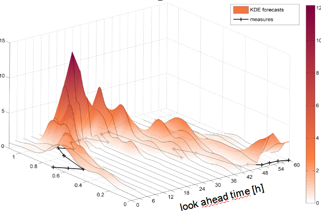

```{r setup, include=FALSE}
knitr::opts_chunk$set(echo = TRUE, warnning=F, message=F, dpi=100, cache=T)
```

## 關於本課程

* 這段課程的主題是 __R__ 繪圖，包含以下概念：
    * 基本繪圖原理
    * `ggplot2`
    * 實際案例練習


## R 的繪圖

* 用範例學習：[R Graphics]() by _Paul Murrell_
    * 著名的參考書，網路版免費
    * 選你想要畫的圖，看程式碼，然後修改

* [The R Graph Gallery](http://www.r-graph-gallery.com/)
    * 更多的範例

* 動手做：
    * [Quick-R: Creating a Graph](http://www.statmethods.net/graphs/creating.html)


## 開始動手吧

```{r}
attach(mtcars)
plot(wt, mpg) 
abline(lm(mpg~wt))
title("Regression of MPG on Weight")
```


## R 繪圖參數
```{r}
hist(mtcars$mpg)
```


## R 繪圖參數 par()
```{r, eval=F}
# 用 par() 來設定繪圖參數

par()              # 列出現有設定
opar <- par()      # 複製現有設定
par(col.lab="red") # 把座標軸說明改成紅色 
hist(mtcars$mpg)   # 用新設定繪圖 
par(opar)          # 回復原有設定
```


## R 繪圖參數示範：在同一畫面繪製多張圖
```{r}
par(mfrow=c(1,2))  # 把繪圖區分割成 1x2 （一列，兩欄）
hist(mtcars$mpg)
hist(mtcars$wt)
```

## R 繪圖參考資料

* [基本繪圖](http://www.statmethods.net/graphs/)
* [進階繪圖](http://www.statmethods.net/advgraphs/index.html)
* [繪圖基本參數](http://www.statmethods.net/advgraphs/parameters.html)
* [繪圖區域與邊界設定](http://research.stowers-institute.org/efg/R/Graphics/Basics/mar-oma/index.htm)


## 進階繪圖：`ggplot2`

`ggplot2`簡介

* 設計依據繪圖理論 `grammar of graphics` (Wilkinson, 2005)
* 由 Hadley Wickham 在 Iowa State 讀研究所時開發完成
* 高階語言（用人話叫機器畫圖）
* 高度彈性，可以用 theme system 美化外觀
* R 的第三繪圖系統 (前兩個是 __base__ 和 __lattice__)
* 成熟而且完整的繪圖系統（可以透過 CRAN 安裝）
* 網站：http://ggplot2.org (完整的參考文件)
* 很多討論區可以問人


## 進階繪圖：`ggplot2`

有些用途，用 `ggplot2`是不行的

* 3D 圖 (see the rgl package)
* 圖論的圖 (nodes/edges layout; see the igraph package)
* 互動圖 (see the ggvis package)

```{r, echo=F}

```

## 繪圖的文法 `grammar of graphics`

### 簡單的說，這個文法將統計繪圖視為一種由 __資料__ 到 __幾何物件__ （點、線、多邊形）和 __美學屬性__ （顏色、形狀、大小）的 __映射__（mapping）


#### “In brief, the grammar tells us that a statistical graphic is a __mapping__ from data to __aesthetic__ attributes (colour, shape, size) of __geometric__ objects (points, lines, bars). The plot may also contain statistical transformations of the data and is drawn on a specific coordinate system”    ---- from _ggplot2_ book


## 聽起來很有道理，但是那是什麼意思？

```{r}
ggplot(data=mpg) +                   # 資料層
  aes(x=displ, y=hwy, color=drv) +   # 資料和圖形元件的映射
  geom_point()                       # 用「點」畫這張圖
```


## 繪圖的文法 `grammar of graphics`

將一張圖分割成各自獨立的元件，類似 `XML` 的概念，這些元件包括：

* data
* aesthetic mapping
* geometric object
* statistical transformations
* scales
* coordinate system
* position adjustments
* faceting


## R 繪圖系統: Base

- “Artist’s palette” model
- 從一張空白的畫布開始
- 用 `plot` 函數 (或相似的函數) 初始化一張畫布
- 用修飾函數 (`text`, `lines`, `points`, `axis`) 來編修畫布
- 方便，直覺的反映資料分析的思維方式
- 繪圖等於一連串的 R 命令，需要先思考妥當再繪圖


## R 繪圖系統: Base: Lattice

- 圖形由單一函數來完成 (`xyplot`, `bwplot`, etc.)
- 最適合呈現變項間的關係: 當 $y$ 與 $x$ 改變時， $z$ 的變化情形
- 座標軸等細節由系統自動設定
- 善於一次呈現多個圖
- 只有一個指令來繪圖，不夠方便、直覺


## ggplot2 繪圖的基本元件
- A _data frame_：資料
- _aesthetic mappings_: 資料要如何對應到顏色、大小 
- _geoms_: 幾何物件，例如 points, lines, shapes. 
- _facets_: 條件圖會用到. 
- _stats_: 統計轉換，例如 binning, quantiles, smoothing. 
- _scales_: 美學映射的設定 (example: male = red, female = blue). 
- _coordinate system_ ：座標系統


## 用 ggplot2 繪圖
- ggplot2 像 base 繪圖，像是在一張空白畫布上作畫（qplot 比較像 lattice）
- 一張圖由許多「圖層」組成：
    - 資料的圖形
    - 摘要
    - 描述及註記


## 範例資料

mpg: 1999 - 2008年 38 個車款的燃油效率資料

```{r}
require(ggplot2)
str(mpg)
```


## ggplot2 的第一張圖

```{r}
qplot(displ, hwy, data = mpg)
```


## 修改美學設定（aes）

```{r}
qplot(displ, hwy, data = mpg, color = drv)
```


## 另一種畫法：qplot() vs ggplot()

```{r}
ggplot(data=mpg) +                   # 資料層
  aes(x=displ, y=hwy, color=drv) +   # 資料和圖形元件的映射
  geom_point()                       # 用「點」畫這張圖
```


## 加入新的幾何物件 geom

```{r}
qplot(displ, hwy, data = mpg, geom = c("point", "smooth"))
```


## 直方圖

```{r}
qplot(hwy, data = mpg, fill = drv)
```


## 一頁多圖: facets

```{r}
qplot(displ, hwy, data = mpg, facets = . ~ drv)
```


## 一頁多圖: facets

```{r}
qplot(hwy, data = mpg, facets = drv ~ ., binwidth = 2)
```


## 範例資料：MAACS

- 過敏原和氣喘的老鼠世代研究（[cohort Study](https://en.wikipedia.org/wiki/Cohort_study)）
- Baltimore 兒童 (年齡 5—17)
- 持續氣喘，且在去年惡化
- 氣喘罹患率與室內環境的研究
- 身高體重指數 BMI 是否會影響 PM$_{2.5}$ 與氣喘之間的關聯性？
- 近期研究發表: http://goo.gl/WqE9j8

```{r,echo=FALSE}
load("./maacs.rda")
```


## 範例資料：MAACS 概觀

- eno: Exhaled nitric oxide, eNO，測量氣喘的指標
- pm25: 空氣懸浮微粒含量（ppm）
- mopos: 老鼠是否過敏

```{r}
str(maacs)
```


## Histogram of eNO

```{r, warning=F}
ggplot(data = maacs, aes(log(eno))) + geom_histogram()
# Alternative:
# qplot(log(eno), data = maacs)
```


## Histogram by Group

```{r, warning=F}
ggplot(data = maacs, aes(log(eno), fill=mopos)) + geom_histogram()
# Alternative:
# qplot(log(eno), data = maacs, fill = mopos)
```


## Density Smooth

```{r, warning=F}
ggplot(data = maacs, aes(log(eno))) + geom_density()
# Alternative:
# qplot(log(eno), data = maacs, geom = "density")
```


## Density Smooth by Group

```{r, warning=F}
ggplot(data = maacs, aes(log(eno), color=mopos)) + geom_density()
# Alternative:
# qplot(log(eno), data = maacs, geom = "density", color = mopos)
```


## Scatterplots: eNO vs. PM$_{2.5}$

```{r, warning=F}
ggplot(data=maacs, aes(x=log(pm25), y=log(eno))) + geom_point()
#qplot(log(pm25), log(eno), data = maacs)
```

## Scatterplots: eNO vs. PM$_{2.5}$

```{r, warning=F}
ggplot(data=maacs, aes(x=log(pm25), y=log(eno))) + geom_point(aes(shape=mopos))
#qplot(log(pm25), log(eno), data = maacs, shape = mopos)
```

## Scatterplots: eNO vs. PM$_{2.5}$

```{r, warning=F}
ggplot(data=maacs, aes(x=log(pm25), y=log(eno))) + geom_point(aes(colour=mopos))
#qplot(log(pm25), log(eno), data = maacs, color = mopos)
```


## Scatterplots: eNO vs. PM$_{2.5}$

```{r, warning=F}
ggplot(data=maacs, aes(log(pm25), log(eno))) + geom_point(aes(colour=mopos)) + geom_smooth()
#qplot(log(pm25), log(eno), data = maacs, color = mopos, geom = c("point", "smooth"))
```


## Scatterplots: eNO vs. PM$_{2.5}$
```{r, fig.width=9, warning=F}
ggplot(data=maacs, aes(log(pm25), log(eno))) + geom_point() + 
  geom_smooth() + facet_grid(.~mopos)
#qplot(log(pm25), log(eno), data = maacs, geom = c("point", "smooth"), 
#       facets = . ~ mopos)
```


## 註解層

- 標籤(Labels): `xlab()`, `ylab()`, `labs()`, `ggtitle()`
- 每個幾何物件 (“geom_xxx”) 都有參數可以修改 
- 整張圖的屬性修改，可以使用 `theme()` 
    - Example: `theme(legend.position = "none")` 
- ggplot2 內建兩套「主題」
    - `theme_gray()`: 預設主題 (灰底)
    - `theme_bw()`: 黑白主題，較乾淨 


## 修改美學設定（aes）

```{r, warning=F}
g <- ggplot(maacs, aes(log(pm25), log(eno)))
g + geom_point(color = "steelblue", size = 4, alpha = 1/2)
```


## 修改美學設定（aes）

```{r, warning=F}
g + geom_point(aes(color = mopos), size = 4, alpha = 1/2)
```


## 修改標籤設定

```{r, warning=F}
g + geom_point(aes(color = mopos)) + labs(title = "MAACS Cohort") + 
    labs(x = expression("log " * PM[2.5]), y = expression("log " * eNO))
```


## 自定 smooth 設定

```{r, warning=F}
g + geom_point(aes(color = mopos), size = 2, alpha = 1/2) + 
    geom_smooth(size = 4, linetype = 3, method = "lm", se = FALSE)
```


## 更改主題

```{r, warning=F}
g + geom_point(aes(color = mopos)) + theme_bw(base_family = "Times")
```


## 座標軸範圍

```{r, warning=F}
testdat <- data.frame(x = 1:100, y = rnorm(100))
testdat[50,2] <- 100  ## Outlier!
plot(testdat$x, testdat$y, type = "l", ylim = c(-3,3))
```


## 座標軸範圍

```{r, warning=F}
g <- ggplot(testdat, aes(x = x, y = y))
g + geom_line()
```


## 座標軸範圍

```{r, warning=F}
g + geom_line() + ylim(-3, 3)
```


## 座標軸範圍

```{r, warning=F}
g + geom_line() + coord_cartesian(ylim = c(-3, 3))
```


## 小結

- ggplot2 是非常強大的繪圖工具
    - Hadley Wickham 的 _ggplot2_ 參考書
    - Winston Chang 的 _R Graphics Cookbook_ 參考書
    - ggplot2 網站 (http://ggplot2.org)
    - ggplot2 論壇 (http://goo.gl/OdW3uB) （開發者為主）
- 有些圖需要使用 ggplot2 以外的套件
- 用範例學習：選你想要畫的圖，看程式碼，然後修改
    - [R Graphics]() by _Paul Murrell_
    - [The R Graph Gallery](http://www.r-graph-gallery.com/)


